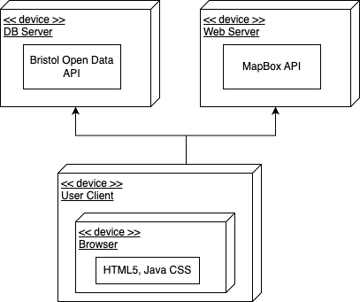
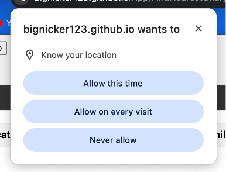
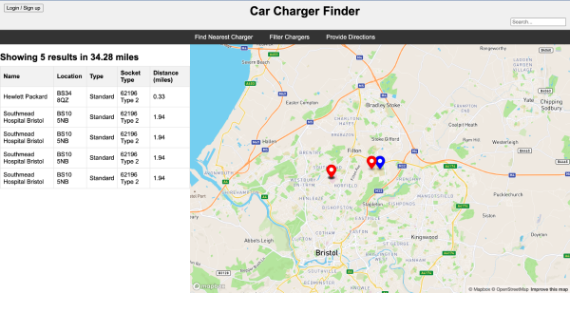
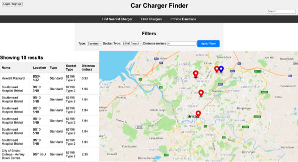

# Deployment

## Release Notes
Version 1.0.1 - The current system supports the functionality of the splash page and use cases one and two. This enables users to find the closest five chargers using use case one and to filter chargers based on various attributes using use case two. Use case three is currently under development. The functionality of this application depends on the Bristol Open Data API and MapBox API. If either of these services is unavailable, the application will not operate as intended. The Deployment Diagram depicted below illustrates the interaction of this web application with Bristol Open Data and MapBox.

# User guide

### Use Case 1
Use case 1 works automatically with very little user input. To make use case 1 function, the user may need to allow the program to use their location as illustrated in the image below

Once the app has access to the user's location it will populate the map and results table with the closest five chargers as illustrated in the image below

### Use Case 2
Similarly to use case 1, use case 2 also requires the user's location. 

Once the program has the user's location, in use case 2, it will display a filter menu above the map and results table. This filter menu allows the user to filter based on charger speed, socket type and distance (radius). Once the apply filters button has been clicked the program will apply these filters and display relevant results in the table and on the map. Above the table it will also display how many results are being shown. This is all illustrated below in a screen shot of use case 2.

### USe Case 3

TODO: Explain how each use-case works by providing step-by-step screenshots for each use-case. This should be based on a tested scenario.

TODO: Repeat as necessary
