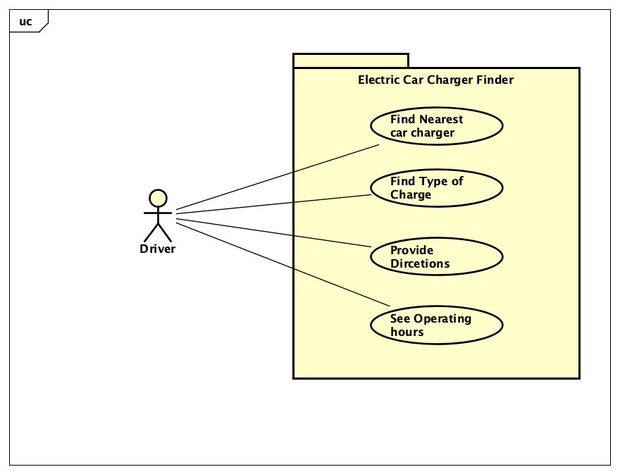

# Requirements

## User Needs

### User stories
* As an electric car user I want to find car chargers so I can charge my car.
* As a user, I want to filter charging stations based on the type of charger (e.g., Level 2, DC Fast Charger) so that I can choose the one that is compatible with my electric car.  
* As a user, I want to be able to see the charging station's operating hours and pricing information, if available, so that I can plan my charging stops efficiently and budget for it.  
* As a user, I want the app to provide directions to the selected charging station, either through an integrated navigation system or by launching a third-party navigation app.  

### Actors
Actors that appear in the following use-cases are as follows:

* Driver - An electric car user

### Use Cases

| UC1 | Find nearest charger | 
| -------------------------------------- | ------------------- |
| **Description** | Show the charger and driver on the map with the driver at the centre |
| **Actors** | Driver |
| **Assumptions** | None
| **Steps** | <ol><li>Select the map</li><li>Give permission to use location</li><li>Get charger coordinates from database</li><li>Centre map on user location</li><li>Add a marker on the map for each charger</li></ol> |
| **Variations** | None |
| **Non-functional** |  |
| **Issues** |  |

| UC2 | Find type of charger | 
| -------------------------------------- | ------------------- |
| **Description** | To allow the driver to filter the type of charger,(e.g., Level 2, DC Fast Charger) |
| **Actors** | Driver |
| **Assumptions** | Permission has been given to use user location</td></tr>
| **Steps** | <ol><li>Show a drop down menu</li><li>Allow user to filter options from menu</li><li>Get charger coordinates from database</li><li>Show filtered results with a marker on the map for each charger</li></ol> |
| **Variations** | None |
| **Non-functional** |  |
| **Issues** |  |

| UC3 | Provide Directions | 
| -------------------------------------- | ------------------- |
| **Description** | Provide directions to the charger on an interactive map |
| **Actors** | Driver |
| **Assumptions** | Permission has been given to use user location</td></tr>
| **Steps** | <ol><li>Select a charger from the map</li><li>Get charger coordinates from database</li><li>Use google maps API to provide directions to the charger</li></ol> |
| **Variations** | None |
| **Non-functional** |  |
| **Issues** |  |

### Use-case Diagram

### Robustness Diagram

## Software Requirements Specification
### Functional requirements
**FR1.1** The system should allow the user to find the nearest charger using UC1.  
**FR1.2** The system should add markers for each charger on the map. 
**FR2.1** The system should allow the user to find and filter chargers based on their type using UC2. 
**FR3.1** The system should provide the user with directions to the charger using UC3. 
**FR4.1** The system should get permission to access user location via geolocation object. 
**FR4.2** The system must query the database to get the charger coordinates. 

### Non-Functional Requirements

**NFR1** The app should work on mobile and desktop (Portability).  
**NFR2** The app should display up to 5 of the closest chargers at a time (Usability).  
**NFR3** There is no security required (Security).  
**NFR4** The source code should be accessable from GitHub (Maintainability).  
**NFR5** The app should return formatted data to the user within 5 seconds (Performance Efficiency).  
**NFR6** The app should work on different browsers (Compatability).  
